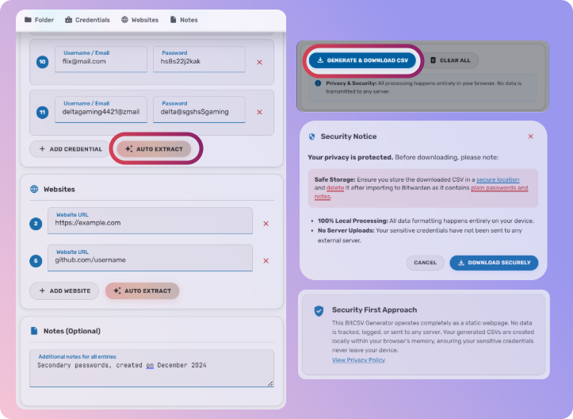
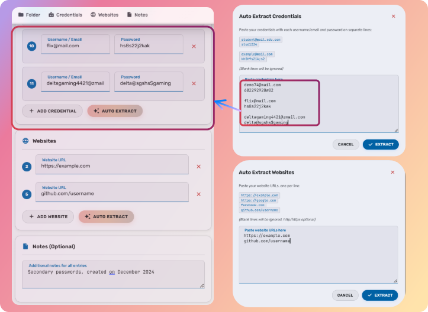
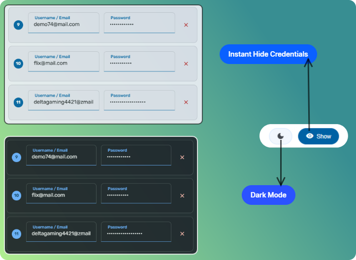

# BitCSV 
> Generate **Bitwarden import-ready CSV files** for multiple accounts and websites using a **simple HTML interface**.

# **✨ Features**

## 📂 1. Generate Bitwarden Import CSV

Generate **Bitwarden import-ready CSV files** for multiple accounts and websites using a **simple HTML interface**.

**Key Highlights**

* Supports multiple accounts
* Quick CSV export compatible with Bitwarden
* No complex setup required

## 📋 2. Extract Credentials to Text Box

**Extract credentials from text and display them in a text box** for easy importing.

**Key Highlights**
* Instant credential extraction
* Clean and readable text format

---

## 🌙 3. Instant Hide Credentials + Dark Mode

Protect sensitive data instantly with **Instant Hide Credentials** and app is combined with a sleek **Dark Mode interface**.

**Key Highlights**
* One-click credential hiding
* Improved privacy when sharing screens
* Built-in dark mode for comfortable viewing
* Modern, distraction-free UI
* 🔒 Privacy First:
  * No data is collected
  * Everything runs fully offline
  * Your credentials never leave your browser

---

## 🚀 Why Use BitCSV?
* When migrating credentials from a browser to Bitwarden, you may have multiple usernames for the same website.
* Manually copying credentials and creating separate entries in Bitwarden can be slow and repetitive.
* BitCSV allows you to add multiple usernames for the same site and automatically generate a Bitwarden-compatible CSV file.
* This saves time compared to creating each entry manually inside Bitwarden.

## ⚠️ Security Note
* Always handle credentials carefully and avoid sharing sensitive files publicly.
* Delete `.csv` files after importing to BitWarden as passowords and notes are stored in **Plain text**.

---

⭐ If you find this tool useful, consider contributing or sharing it!
